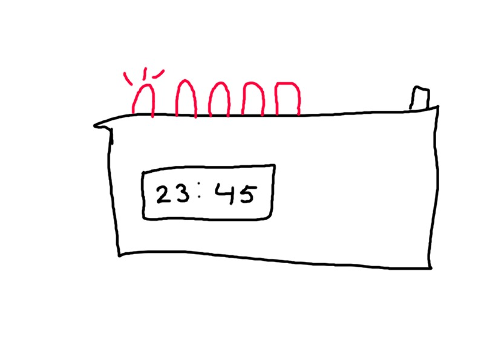

## DeluxeAlarm

_My journey through whatever this is._

DeluxeAlarm is a project that I've been thinking about for some time, basically in it's core it's a simple 4-segment display showing the time. But on top of that it's going to have a public-accessable Web API to send data to.

Through the use of the button (toggler) and multiple LEDs, you'll be able to switch through profiles, with any data that can be set from the API, wether it is the time, or a counter, or email notifications.

## 1. Initial idea

I had a certain picture in my head that I wanted to use, I draw it out in MS Paint, for clearance:

Then I got started to coding, and that evening I set up a prototype that works with multiple profiles, 2 LEDs, and a button.

## 2. Get to coding

[TODO C++]

## What now?

This will be a side project of mine, I'm planning on totally rewriting the code, use proper C++ (as I have next to no experience), add Web UIs / Web APIs, and a 3D print for the enclosure.